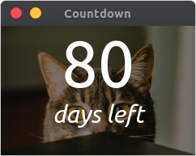

# countdown-applet



Super-duper simple Electron Applet to count down the amount of days to a date from today. This uses code from [electron/electronquickstart](https://github.com/electron/electron-quick-start).

## To Use

To clone and run this repository you'll need [Git](https://git-scm.com) and [Node.js](https://nodejs.org/en/download/) (which comes with [npm](http://npmjs.com)) installed on your computer. From your command line:

```bash
# Clone this repository
git clone https://github.com/tofustardust/countdown-applet.git
# Go into the repository
cd countdown-applet
# Install dependencies
npm install
# Run the app
npm start
```

You can also set `start.sh` to run on system startup using various methods. See what works for you!

## Configuration

To change the background, simply replace the bg.jpg file provided [(unsplash link)](https://unsplash.com/photos/bsSIk3LV_NE) with anything larger than 240x160.

To change the date set, currently it requires editing the existing Js in `index.html` to change the date shown. Future plans include loading a date from an easily editable file.

## Broken Bits

As said before, date changing should be improved to have a non-icky way to update the info. Something like a shell script that creates a date object and Js to load from a file would be perfect.

As well as that, the app icon is broken on Ubuntu, and I'm not sure if it's possible to fix that without packaging the app with [electron/electron-packager](https://github.com/electron/electron-packager). Something to learn for future projects, possibly. This is just a little applet I wanted to have so threw it all together really quickly.
